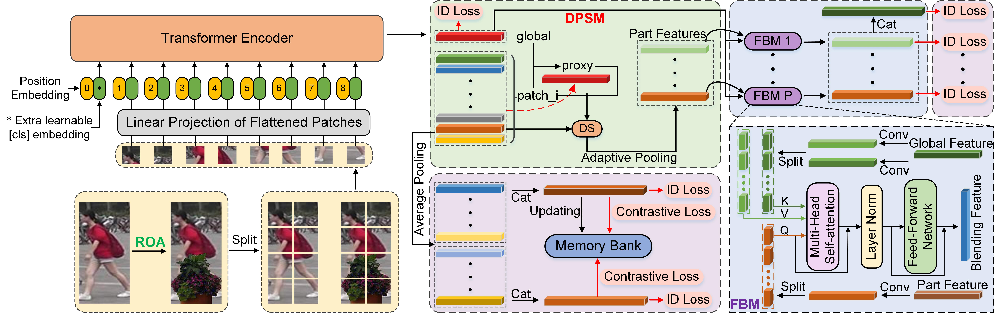
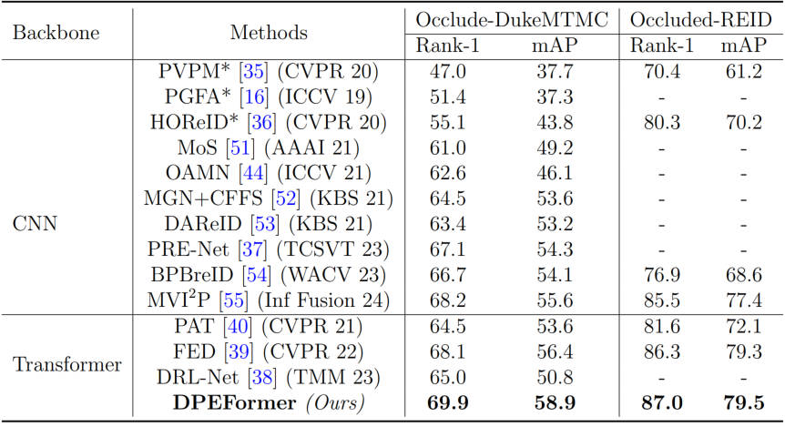
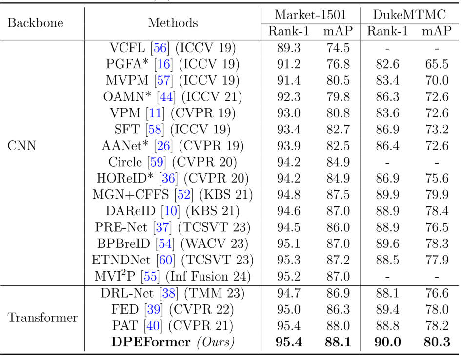
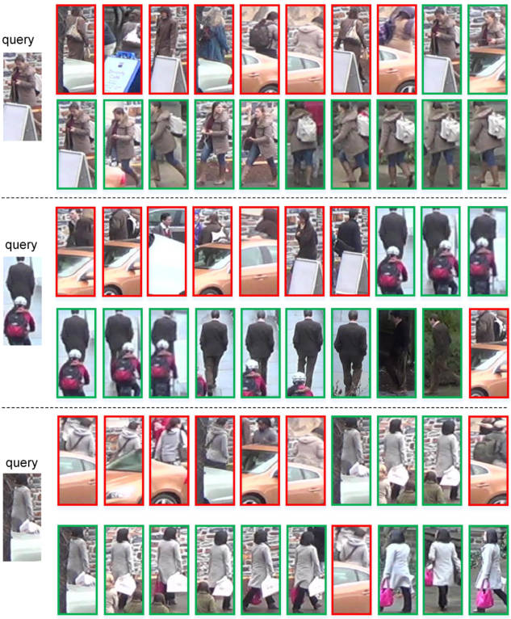

# Dynamic Patch-aware Enrichment Transformer for Occluded Person Re-Identification
Pytorch implementation for the occluded person reid algorithm
described in the paper
[Dynamic Patch-aware Enrichment Transformer for Occluded Person Re-Identification](https://arxiv.org/pdf/2402.10435)

## Pipline
<div align="center">
  
 </div>
 
 ## Experiment Results on Occluded and Holistic Person ReID Datasets
 <div align="center">
  
 </div>
 
 <div align="center">
  
 </div>
 
 ## Retrieve Comparison with baseline model 
 <div align="center">
  
 </div>
 
 
 ## Requirements
 ### Installation
 Please refer to [TransReID](https://github.com/damo-cv/TransReID) 
 ### Dataset Preparation
 Please download Occluded-Duke dataset and our [SA-1B-crop](https://drive.google.com/file/d/1LWwMf2jk3Bif_09VGc-TUfInpWq9xVcA/view?usp=drive_link) made by [SAM](https://github.com/facebookresearch/segment-anything). Meanwhile place cropped masks into corresponding datasets root (just because of dataloader).
 ### Pretrained Model Preparison
 Please download pretrained [ViT backbone](https://github.com/rwightman/pytorch-image-models/releases/download/v0.1-vitjx/jx_vit_base_p16_224-80ecf9dd.pth) in advance.
 
 ## Model training and testing
 before training and testing, please update config file accordingly.  Around 13G GPU memory is required. 
 ~~~~~~~~~~~~~~~~~~
   python train.py 
 ~~~~~~~~~~~~~~~~~~

## Citation

If you find this code useful for your research, please cite our paper

```
@inproceedings{zhang2024DPEFormer,
  title={Dynamic Patch-aware Enrichment Transformer for Occluded Person Re-Identification},
  author={Zhang, Xin, Keren Fu, and Qijun Zhao},
  booktitle={arXiv preprint arXiv:2402.10435, 2024},
  year={2024}
}
```

## Contact

If you have any question, please feel free to contact us. E-mail: [zhangxinchina1314@gmail.com](zhangxinchina1314@gmail.com) 
